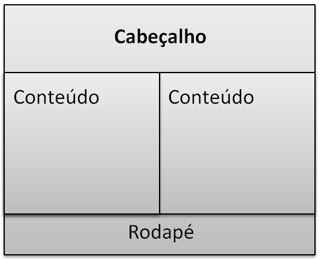

# **Atividades Assíncronas 4 - Folha de Estilo em Cascata**

## **Descrição**

Olá, esta é a descrição de um conjunto de atividades assíncronas para a semana.  As atividades aqui relacionadas, quando realizadas por você e entregues dentro do prazo, serão registradas conforme a referência de datas acima. 

##  **Atividade 1 - Vìdeo: Folha de Estilo em Cascata**
Assista ao video que apresenta as ideias gerais da linguagem CSS: https://drive.google.com/file/d/1WYUmJrwf3r-u78i6qVKCFs7-M2OhN4eh/view?usp=sharing

Abaixo segue um vídeo adicional, com uma abordagem mais prática: https://drive.google.com/file/d/14M5jGmSX18_xRe7iUnfu14XIMuEqOxc1/view?usp=sharing

## **Atividade 2 - Leitura:  Ler o conteúdo do tutorial CSS da W3 Schools (Apenas as seções dentro de CSS HOME):**
https://www.w3schools.com/css/default.asp

## **Atividade 3:  Prática:**
Construa uma página (HTML e CSS) que possua uma estrutura igual a da imagem abaixo.

## **O que deve ser entregue?**
Arquivos fonte da página com a solução da atividade 3 (.html, .css), ou um texto explicando suas dificuldades.
